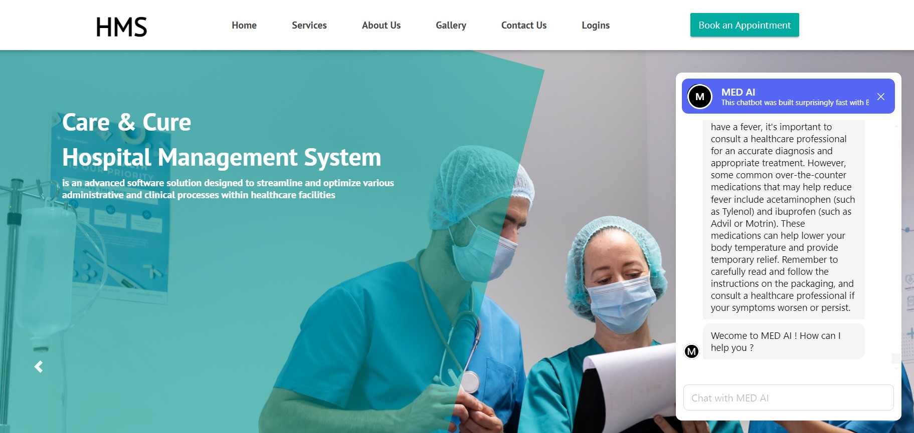

# HACKFEST (Topic: Smart Health Care)

## Hospital Management System Care and Cure

Welcome to the Hospital Management System **Care and Cure** repository, developed by **Team Bits N' Bytes**.

## Introduction

Our Hospital Management System Care and Cure is designed to streamline and optimize hospital management processes. With an integrated AI-powered chatbot, this system aims to provide comprehensive support for managing patient records, appointments, medical staff, inventory, billing, and patient interaction.

The AI chatbot serves as a virtual guide, assisting patients with inquiries, providing information about services, and offering support throughout their healthcare journey. Our goal is to enhance efficiency, accuracy, and patient care within healthcare facilities, providing a seamless experience for both medical staff and patients.

## Features
- **AI Chatbot**: Implement an AI-powered chatbot for patient interaction, providing information, assistance, and support.
- **Patient Management**: Easily manage patient records, including personal information, medical history, and treatment plans.
- **Appointment Scheduling**: Efficiently schedule and manage patient appointments with doctors and other medical staff.
- **Staff Management**: Keep track of medical staff, their roles, schedules, and assignments.
- **Inventory Management**: Manage hospital inventory, including medicines, medical equipment, and other supplies.
- **Billing and Invoicing**: Generate bills and invoices for patient services and manage payment records.

## Usage
1. Access the application through your web browser at [http://localhost:3000](http://localhost:3000) (or the appropriate port).
2. Log in using your administrator credentials.
3. Utilize various modules to manage hospital operations efficiently, and interact with the AI chatbot for patient support.

## Contributors
- Sarbojit Podder (L)
- Pushan Mukhopadhay
- Ankan Kundu
- Anirban Mondal
- Jyotiraditya Pal
- Sudutta Bardhan

## License
This project is licensed under the MIT License - see the [LICENSE](LICENSE) file for details.

## Feedback
We welcome feedback and contributions. Feel free to open an issue or submit a pull request.

Thank you for using Hospital Management System Care and Cure!

**Team Bits N' Bytes**
